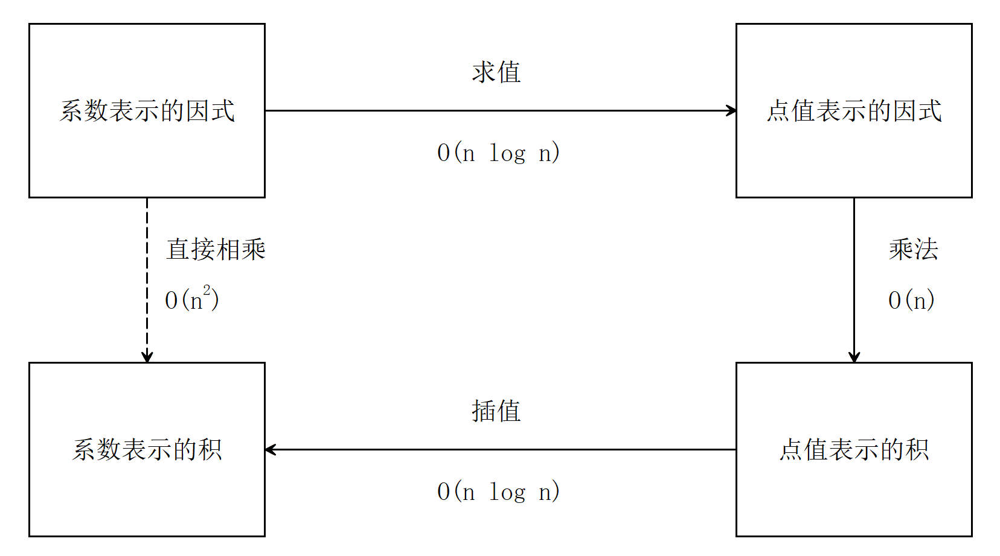

### 0

退役。异常沉重的两个字。

退役，意味着告别。和过去告别，和我整整装了一个文件夹的资料告别，和那几百个代码文件告别。  

过去，是美好的。在美好中，最不舍的，是那个始终微笑着的面容。  

资料，是整洁的。在整洁中，最纯净的，是那些写满清秀字迹的稿纸。  

代码，是精妙的。在精妙中，最难忘的，是那段充满灵气的函数。  

我翻出资料夹，打开那熟悉的一页。纸上的字迹仍是如此清晰，仿佛是昨天刚写下的一般。  

眼眶有些湿润。  

怀着复杂的心情，我翻到了第一页。  

那日的情景，又浮现在我眼前……  

### 1

又是一个燥热的夏夜。  

学OI真是累啊，连暑假还要去上课，课的内容又有好多听不懂，干脆放弃算了。  

还有这道题，怎么写了半天都不对啊。不知不觉中，右下角的时间已经从21:00变成了1:00，我也不知打了多少哈欠，可提交状态却丝毫不体谅我，仍气鼓鼓地发出刺眼的红色。  

不写了，睡觉！我愤而关闭了电脑，躺上床去。  

尽管天气很热，但床的柔软让我安下心来，意识逐渐模糊。  

不知何时，耳边传来一声轻柔的呼唤：“Sweetlemon，早上好！”  

这声音……有些熟悉？听着很舒服，很有安全感。会是谁呢？  

缓缓睁开眼，一个微笑着的少女映入眼帘。似乎有些意外，我直接从床上坐了起来：“你……你是谁？“  

少女尴尬地笑笑：“哦，好像我还没有自我介绍说呢。我叫Hanakiko，就是花希子，花瓣的花，希望的希，叫我花希就好啦。”    

“花希？读着好像哈希呢。还是直接叫Hanakiko吧。”    

“哈希么？好像是的……总之都可以的！”   

“你是怎么知道我的名字的？你来找我有什么事呢？”我疑惑极了。   

“名字嘛，我似乎很久以前就知道，也不记得是怎么知道的了。我想交一个OIer朋友，于是就来找你啦。”    

OIer朋友？我定睛看着站在床边的少女。大眼睛里水晶般闪亮的蓝瞳，微微上扬的嘴角，白色的水手服，棕褐色的双马尾发辫，浅粉色的发夹——真似两朵小花。对于平时几乎不和女生来往的我来说，能交一个这样的朋友，还真有些激动，也有些紧张。  

可是——OIer？我能算是OIer吗？   

“呃，你怎么知道我是OIer？我可是即将要放弃……的。”我似乎有些犹豫。   

“啊？放弃？Sweetlemon可一定不要放弃啊……”她似乎急了，思考片刻，又问，“是有什么困难吗？”    

“唉，可困难了。上课听不懂，题目不会做，我简直不知道我怎么学下去！”我拼命地发泄，也不想管她的感受。等等，这是不是有点对不起她……  

“上课听不懂吗？老师都讲了什么呢？”她仍是耐心地询问着。  

“这几天在讲什么FFT，行列式，复数单位根之类的。似乎怎么都听不懂……”  

“哦，FFT啊。确实有点难理解。不如……我讲给你听吧。”  

“你？呃……还是算了吧。”我有些不相信，她似乎怎么看都不像是擅长OI的……  

“什么呀，不相信我？”她似乎有些气恼，“先听我讲讲再评价呀！”  

“好吧，如果你愿意的话就讲吧。”  

她直看着躺在床上一动不动的我，片刻后说：“你想躺着听么？”  

看着正站在床边的她，又想到我正舒服地躺在床上，我心中立即生出歉疚感。“对不起对不起，忘了你还站着。”说着，我忙从床上爬起来——不知为何，精神百倍，倦意全无——到客厅搬来张椅子，又取出纸杯，倒些冰可乐，端给她：“呐，给你。”  

她似乎有些惊喜，愣了一下，脸泛起粉红，嘴笑得弧度更明显了：“啊……是给我的吗？谢谢！”便接过纸杯，喝下一小口。  

我在她身旁的椅子坐下，找出笔和草稿纸。她身上散发出淡淡的花香——花希子，人如其名。   

“那么，我们言归正传吧。Sweetlemon，你知道FFT是用来做什么的吗？”她放下纸杯，拿起桌上的笔。  

“呃，好像是用来……做多项式乘法的？”  

“对。那你知道什么是一元多项式么？”  

“花一块钱就能买到的多项式！”她听着我的回答，忍不住笑了出来，忙用手遮住嘴。看着她笑的样子，我也忍俊不禁。  

“呃，我开玩笑的。就是仅含一个变量的多项式，也就是$f(x)=a_0+a_1x+a_2x^2+\cdots+a_nx^n$这样子。”  

她轻轻笑了笑：“还别忘了$a_n\neq 0$哦。如果上式中$a_n\neq 0$，那么我们就说$f(x)$是一个$n$次多项式。”  

“这很简单嘛。”我抱怨般地说。  

“是啊，所以FFT就很简单啊。”她狡黠一笑。  

我哑口无言。  

“好啦，逗你的，其实FFT还是有一些地方需要慢慢理解的，不过我保证我能让你听得懂！”看着她自信的微笑，我不知为何感到放心。  

“那么我们继续吧。我们引入一个简单的定义：次数界。如果一个多项式的次数小于$n$，我们就说这个多项式的次数界为$n$。例如，我们可以说$f(x)=x^2$的次数界为$3$，也可以说它的次数界为$4,5,6$等等。那么，一个次数界为$n$的多项式$f(x)$与一个次数界为$m$的多项式$g(x)$相乘，乘积$f(x)g(x)$是一个次数界为$n+m-1$的多项式，这个说法对吗？”  

“$f(x)$的次数$\deg f \le n-1$，$g(x)$的次数$\deg g \le m-1$，所以$f(x)g(x)$的次数$\deg fg\le n-1+m-1=n+m-2$……应该是对的吧。”我在草稿纸上推算着。  

“没错。那么，下一个问题，若已知某多项式$f(x)$的次数界为$n$，又已知它函数图象上$n$个不同的点$(x_1,f(x_1)),(x_2,f(x_2)),\cdots,(x_n,f(x_n))$的坐标，是否就能唯一确定这个多项式了呢？”  

“当然了，待定系数法嘛。”  

“待定系数法得到的方程组一定有唯一解吗？”她转过身来看着我。  

“呃……一定……大概是一定吧。反正我就没有解不出来过。”  

“又是‘大概’又是‘一定’，你这是什么意思啊？”她笑着说，“确实一定有唯一解，但严格的证明要用到‘范德蒙德行列式’的性质；既然你理解它一定有唯一解，那我就不再证明了吧。”  

“那么，既然$n$个不同点的坐标可以确定一个次数界为$n$的多项式，那我们就可以用这样一组点来表示这个多项式，叫做这个多项式的点值表示法。点值表示法和我们以前用的系数表示法是表示多项式的两种方法，它们可以互相转化。”说着，她在纸上写下了“点值表示法”和“系数表示法”，字体清秀，赏心悦目，我不由得多看了几下。    

“那么，系数表示法如何转换成点值表示法呢？”她指着纸上的字，问道。  

我片刻后才从她的字中回过神来，忙说：“呃，我想想……直接代进去求值就好了嘛。”  

“对。这个过程可以用秦九韶算法降低算法常数，就像这样：$$a_3x^3+a_2x^2+a_1x+a_0=(a_3x^2+a_2x+a_1)x+a_0=((a_3x+a_2)x+a_1)x+a_0.$$” 

我仔细对比着她写下的式子。她的数学字体也很美观，看起来像是会书法的数学家写的一样。呃，我好像分心了……  

“点值表示法又如何转换成系数表示法呢？”  

“解方程……高斯消元？那个好难写啊。”  

“确实可以用高斯消元。当然，也有更好的方法。”  

她停顿了一下，又说道：“点值表示法有什么好处呢？它更便于做乘法。试想，如果已知两个次数界为$n$的多项式$f(x)$和$g(x)$的各项系数，如何求他们的乘积$f(x)g(x)$的各项系数呢？”   

“写个二重循环，对于$f(x)$的每一项，都拿它去乘$g(x)$的每一项。像这样：”  

```cpp
for (int i=0;i<n;i++)
    for (int j=0;j<n;j++)
        ans[i+j]+=f[i]*g[j]
```
“那么如果已知点值表示法，如何求$f(x)g(x)$的点值表示法呢？也就是，给定$n$个不同的数$x_1, x_2, \cdots, x_n$，已知$f(x_1), f(x_2), \cdots, f(x_n)$和$g(x_1), g(x_2), \cdots, g(x_n)$，如何求$f(x)g(x)$的点值表示呢？”  

她眨了眨眼，轻轻笑着，看着我。怎么觉得这笑容里藏着些什么……算了，先思考这个问题吧。  
灵感突然来了。“这还不简单！$f(x)g(x)$在$x=x_0$处的取值就是$f(x_0)$与$g(x_0)$之积，所以只要分别把$f(x_1)$和$g(x_1)$、$f(x_2)$和$g(x_2)$这些数乘起来，得到$f(x_i)g(x_i)$作为答案就好了呀。果然真的方便啊。”  

她又忍不住笑出了声：“呀，你果然掉进陷阱里了。”  

我似乎有点生气，但看着她捂着嘴笑着的样子，却又怎么都气不起来。  

“你又粗心了哦。想一下，$f(x)g(x)$的次数界是多少？”她止住笑，提示道。  

“呃……$2n$？”我似乎突然觉察到了什么，猛一拍脑袋，“啊，是这个问题啊！”没办法，自己不细心，在她面前丢脸了。  

“因此我们需要至少$2n-1$个点的值才能够这样计算呢。也就是，用点值表示法计算乘积的时候，我们需要多一倍的点，就是必须知道$f(x)$和$g(x)$在$x_1, x_2, \cdots, x_{2n}$处的取值才行。”她柔声说道。  

“嗯。”我有点不好意思地回答道。  

她似乎听出了我的不甘心，安慰道：“好啦好啦，犯点小错误没事的。这里是易错点嘛，以前我学的时候也错过的。”  

听了她的话，我的心情好多了，心中不知为何涌起一股暖流，感觉我的嘴角也轻轻上扬了。  

“呐，我们再回来看这个方法。系数表示法的乘法需要$\mathrm{O}(n^2)$的时间，点值表示法的乘法只需要$\mathrm{O}(n)$，是不是快多了？所以如果我们把多项式转换成点值表示法，再计算乘法，最后再转换回系数表示法，是不是就快一些了呢？”说着，她在纸上画：  

  

“可求值和待定系数解方程分别需要$\mathrm{O}(n^2)$和$\mathrm{O}(n^3)$的时间啊……那个图上的$\mathrm{O}(n \log n)$是什么意思？”  

“你呀，确实很老实。”她说着，轻轻笑了笑，“$x_1, x_2, \cdots, x_{2n}$这些数是不是可以任取呢？既然这样，我们也许可以代入一些‘好算'的数，使得求值和待定系数——待定系数的这一步叫做‘插值’——的时间都降为$\mathrm{O}(n \log n)$，这样我们就能在$\mathrm{O}(n \log n)$的时间内完成多项式乘法了。”    

“‘好算’的数？是哪些呢？$0,1,2,\cdots,n$？”  

“哈哈，你可以试一试。这个我们下次再聊吧。”她说着，放下笔，便要起身。

“啊，你要走了么……”我忽然感到些不舍。  

“你看，”她指一指窗外，“天快亮了，我要回去了呢。”  

我无言。不知为何，我心中似乎感到要失去什么。  

“没事的呢，我明天晚上还会来的。”她说着，从不知何处找出一盒明信片，“这盒明信片就当是我这次过来送给你的礼物吧。”  

“哇！我可以现在看吗？”  

“不行哦！”她笑着摇摇头，“等我走了再看！”  

“那好吧……”我起身，把她送到门口。  

“再见，Sweetlemon！”她笑着摆摆手。  

“再见，Hanakiko！”我还是有些失落，回应道。

门轻轻关上了。我呆呆地盯着门看……

咦？我怎么还在床上？

这难道是个梦吗？

我急忙来到桌边。

桌上的稿纸整齐地叠放着，纸上清秀的字迹还散发着墨水的清香。桌角整齐地摆着一盒明信片。
