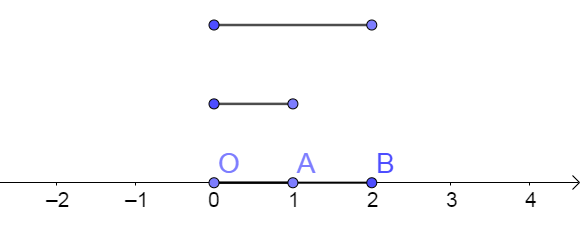
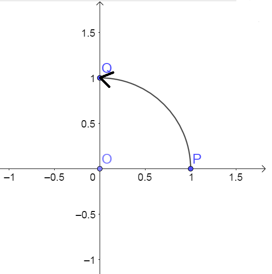

### 2

皎洁的月光洒进窗里，流到我手中的那一张明信片上。  

看一眼手表，我放下明信片，起身洗漱。

明信片上是在海边的Hanakiko，看得出来，她一定很开心吧。不过这笑容和我亲眼所见的笑容相比，还是逊色了些。  

明信片边摆着一张纸条，看字迹就知道是她夹在里边的：“今天的主要内容是复数，可以先复习一下高中课本哦。还有，早点睡觉，我会来的。”

洗漱完毕，我关掉灯，躺上床，仍在思考，这到底是不是一个梦呢？

似乎没过多久，熟悉的声音在耳边响起。“Sweetlemon，我来了哦！”  

睁开眼，又是那让我惊喜的微笑。  

我连忙起身：“你好，Hanakiko！不好意思，没准备好饮料，我去倒一点。”  

“啊，今晚先不要喝可乐比较好吧。我带了些清茶，也许对理解今晚的内容有帮助。”  

“茶？好的吧。”这次我没有找纸杯，而是拿来了两个白瓷的茶杯，素净端庄，和她的衣服十分相配。  

“杯子都消毒过的……”我似乎想到什么，忙说道。  

“呐，没事啦。”Hanakiko拿出一个浅粉色的水壶，把壶里清澈的茶倒进茶杯。浅粉色的发夹、浅粉色的水杯……也许这是她最喜欢的颜色吧。  

“好啦。”她像我昨天那样，把杯子端给我，我连忙双手接过：“啊，非常感谢！”  

似乎刚才我们都脸红了？

“准备好了吗？那么我们开始讲复数了哦。”她拿来一张新的稿纸，写下“复数”两个字。  

“开始吧！”我似乎要“撸起袖子加油干”了。  

“那么今晚你先讲！你来说一下什么是复数和复数的基本运算吧。”Hanakiko看着跃跃欲试的我，笑着说道。

“没问题！”我自信地说，“设数$i$满足$i^2=-1$，把这个数$i$叫做虚数单位。那么，复数就是形如$z=a+bi$的数，其中$a,b$是实数。$a$叫做$z$的实部，记作$\mathrm{Re\ } z$；$b$叫做$z$的虚部，记作$\mathrm{Im\ }z$。当$\mathrm{Im\ }z=0$时，$z$就是实数；当$\mathrm{Im\ }z \neq 0$时，$z$是纯虚数。”

“两个复数的加减法就是实部和虚部分别相加减。”我说着，写下：

$$(a+bi)+(c+di)=(a+b)+(c+d)i\ (a,b\in \mathbb{R})$$

$$(a+bi)-(c+di)=(a-b)+(c-d)i\ (a,b\in \mathbb{R})$$

“两个复数的乘除法只需要根据代数式计算的方法算就可以了。”

$$(a+bi)(c+di)=ac+adi+bci+bdi^2=(ac-bd)+(ad+bc)i$$

$$\frac{a+bi}{c+di}=\frac{(a+bi)(c-di)}{(c+di)(c-di)}=\frac{(ac-adi+bci-bdi^2)}{c^2-(di)^2}=\frac{(ac+bd)+(bc-ad)i}{c^2+d^2}$$

“**停下停下**！”Hanakiko似乎有些着急了。

“好……好的，我说完了。”我急忙停下。是不是我哪里说错了？还是……我呆坐着，直看着她，陷入了短暂的沉默。

Hanakiko看到尴尬的我，似乎发现哪里不对。“呐，不好意思……”她低下头，微笑了一下，“我刚才太粗暴了，对不起……”

她突然的道歉让我不知所措。“啊……没有什么的……其实应该是我来说对不起，我刚才只是一味地念公式，丝毫没有考虑到你的感受……”

“好了，都没事的。”她又笑了笑，“不过，话说回来，Sweetlemon刚才的讲法确实让人比较难理解呢。学习一个知识，必须弄清楚它的本质，这样讲似乎是没有办法知道本质的呢……”

本质？说起来，我也一直不知道复数的本质和意义是什么，对于$i$，我也一直认为是一个强行定义的数。

“那么，就由我来讲一讲吧。”Hanakiko说着，拿起笔，“不过，怎么觉得还是有些对不起Sweetlemon……”

“请不要这么说啊，Hanakiko……”我几乎都要哭出来了。

“好吧，我不提刚才的事了。那么，我们现在进入正题。”

“先从加法的意义开始吧。我们用向量的观点来看数，正数$a$就相当于向数轴正方向移动$a$个单位，负数$-a$就相当于向数轴负方向移动$a$个单位，那么$a+b$就相当于先移动$a$，再移动$b$，方向视$a,b$的符号而定，比如$1-2$就是先向正方向移动$1$个单位，再向负方向移动$2$个单位，最终的结果也就是向负方向移动了$1$个单位。也就是，$1-2=-1$。”

“就是把数看成向量嘛，数的加减法就是向量的加减法。”我概括道。

“没错！你对向量的理解不错哦。“她夸得我有点不好意思。

”那么我们接着讨论一下乘法的意义。结合数轴，观察一下，$1\times 2=2$的意义是什么呢？”

“意义？就是把线段$OA$伸长到原来的$2$倍，变为线段$OB$吧。”我用手比划着数轴上的点，说着。

“是的。那么，$a\times b=ab(b>0)$的意义是什么呢？”

“如果数轴上代表$a$的点是$A$，代表$ab$的点是$B$，那么$a\times b=ab$的意义就是把线段$OA$伸长或缩短为原来的$b$倍，得到线段$OB$。”

“那么如果$b<0$怎么办呢？”她紧接着又问道。

我思考片刻，回答：“$b<0$的话就反向伸长或者缩短吧。”

“反向……”她似乎对我的回答不是很满意，“能不能换个角度解释呢？”

换个角度？还有什么角度呢？

“考虑乘以$-1$的意义？”她提示道。

“乘以$-1$……反向？关于原点对称？”

“啊，看来Sweetlemon的思维有些被限制了呢。”她笑了笑，“其实乘以$-1$可以看做是线段$OA$绕原点旋转$180^\circ$呀。”

旋转？确实是一个新的思考角度呢。

可是，旋转和对称有什么区别呢……

似乎看出了我的疑惑，她接着说道：“旋转可就比对称多了不少可能性哦，等会儿你会看到旋转的魅力的！”

旋转的魅力？旋转总是让我想起平时做的物理题，什么角速度$\omega$，周期$T$之类的……

“如果$b<0$，那么$a\times b$就等于$a\times \left|b\right|\times (-1)$，也就是伸缩$\left|b\right|$倍，再旋转$180^\circ$。这样，乘法的意义就被我们用线段的伸缩和旋转解释了。”

是这样的……我似乎从来没有思考过乘法的几何意义呢。

稍加停顿，她接着说：“如果乘以$-1$是旋转$180^\circ$，那么乘以$1$就是旋转$360^\circ$了，而$360^\circ=2\times 180^\circ$。于是，我们知道，乘以$(-1)^n$就相当于旋转$n\times 180^\circ$。”

“你好像漏了$n\in \mathbb{Z}$哦……”好不容易抓住她的错误，我笑笑说道。

“我是故意漏的啦。”她笑着说，“我们接下来就要把这个式子推广到$n\in \mathbb{R}$的情形呢。考虑$n=0.5$，那么，一个数乘以$\sqrt{-1}$就相当于旋转$90^\circ$。”

“可是旋转$90^\circ$之后这条线段就不在数轴上了呀……”

“不在数轴上，就意味着我们完成了从一维的直线向二维的平面跨越的壮举！”她似乎很自豪。

“描述一个平面上的点，我们需要两条坐标轴。我们把原来的数轴称为实轴，再画一条与实轴垂直的数轴，称为虚轴。那么，$1$乘以$\sqrt{-1}$后，正好到了虚轴上的点$Q(0,1)$处。”

“我们把$\sqrt{-1}$叫做数$i$，那么$i$的意义就是，乘以这个数，结果是原数旋转$90^\circ$。”

“原来$i$的定义是这个意思啊！”我似乎突然明白了什么，“真是太神奇了！”

“等会儿还有更神奇的呢。”她笑笑，“其实，我们到这里已经差不多解决了复数的定义问题。”

> 定义**复平面**为带有两条互相垂直的坐标轴的平面。我们把这两条坐标轴分别叫做**实轴**和**虚轴**。
>
> 实轴上的点$(1,0)$对应的数为$1$，虚轴上的点$(0,1)$对应的数为$i$。
>
> 乘以$i$就相当于把数旋转$90^\circ$，所以乘以$i^2$就是旋转$180^\circ$，那么$i^2=-1$。
>
> 

“还有更神奇的呢。”她笑笑，“如果要旋转$120^\circ$怎么办呢？”

“$120^\circ=180^\circ\times \frac{2}{3}$……那么就乘以$(-1)^\frac{2}{3}$？哦，这样的话$(-1)^{\frac{2}{3}}$这个数就应该是点$(1,0)$旋转$120^\circ$。”

“对。根据三角函数的知识，表示它的点是$(\cos 120^\circ,\sin 120^\circ)$，也就是$(-\frac{1}{2},\frac{\sqrt{3}}{2})$。这个数应该如何用$1$和$i$表示呢？”

“$(-\frac{1}{2},\frac{\sqrt{3}}{2})$就相当于先沿实轴负方向移动$\frac{1}{2}$个单位，也就是$-\frac{1}{2}$；再沿虚轴正方向移动$\frac{\sqrt{3}}{2}$个单位。沿虚轴正方向移动一个单位是$i$，那么移动移动$\frac{\sqrt{3}}{2}$个单位就是$\frac{\sqrt{3}}{2}i$。那么$(-1)^{\frac{2}{3}}=-\frac{1}{2}+\frac{\sqrt{3}}{2}i$咯。”

“没错！一般情况下，$(-1)^a$就是旋转$a\times 180^\circ$，用弧度制表示就是旋转$a\pi$。得到的点是$(\cos a\pi,\sin a\pi)$，因此，$(-1)^a=\cos a\pi+i\sin a\pi$。”